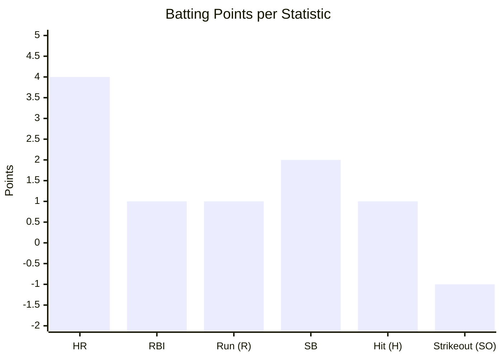
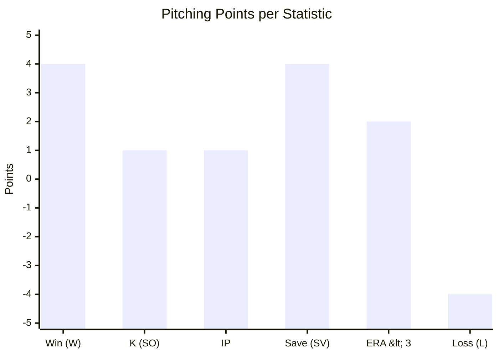
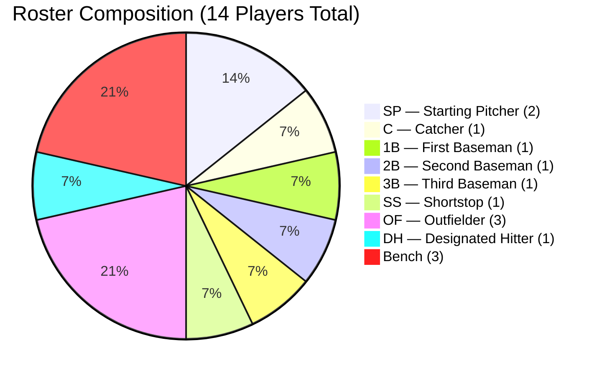
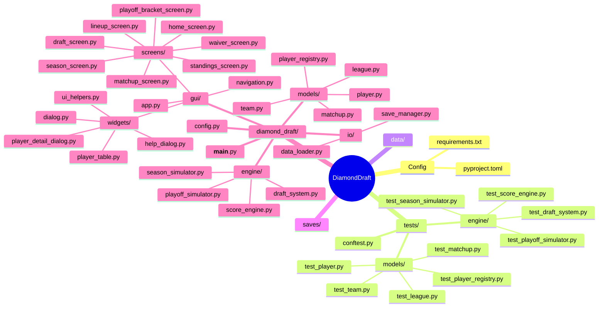
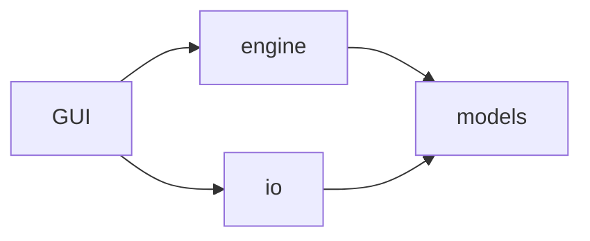
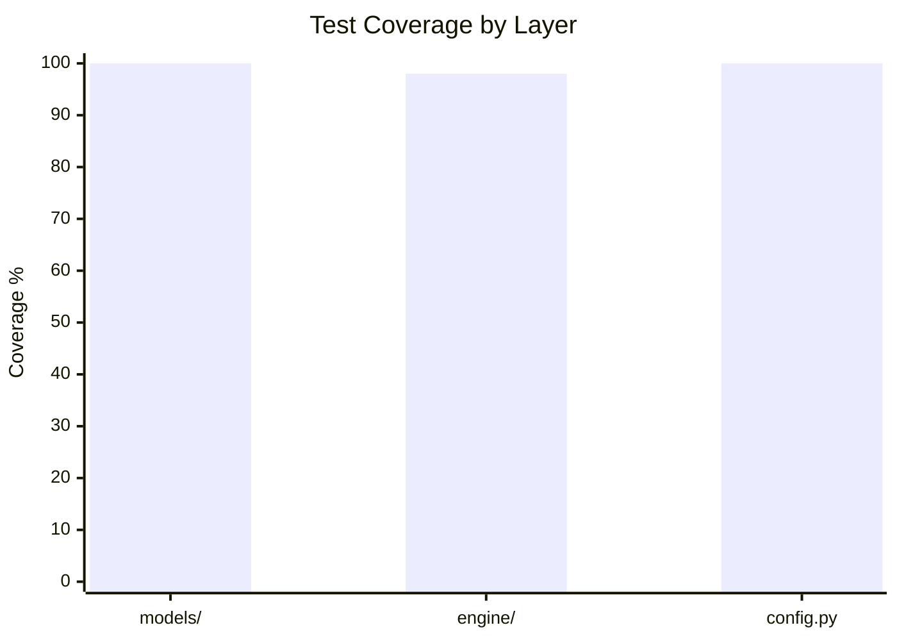

# Diamond Draft


[](https://codecov.io/gh/ibuenuel/DiamondDraft)


**MLB Fantasy League Simulator** — OOP Course Project (Wirtschaftsinformatik, 2026)

Diamond Draft is a local MLB Fantasy League Simulator with a graphical desktop interface.
The player drafts a team from real MLB players and competes in a simulated season against
CPU-managed teams. Scoring is based on real MLB statistics fetched via the
[MLB Stats API](https://statsapi.mlb.com) for a season year of your choice.

---

## Features

- **Snake Draft** — interactive draft against 5 CPU teams (6 teams total)
- **Real MLB Data** — season statistics via the MLB Stats API; choose any year at game start (cached locally per year after first load)
- **Standard Fantasy Scoring** — batting and pitching points per the rules below
- **10-Week Season** — weekly head-to-head matchups with live standings
- **Active Lineup Management** — set a weekly 11-player active lineup from a 14-player roster; bench players contribute no points
- **Injury System** — players have a chance to get injured each week and miss 1–2 weeks
- **Weekly Performance Variance** — healthy players receive a random performance multiplier each week (0.7×–1.3×)
- **Waiver Wire** — drop and pick up players from the free-agent pool between weeks
- **Player Detail View** — double-click any player to see full stats, headshot, team logo, and a points bar chart
- **Playoffs** — top 4 teams advance to a two-round knockout bracket (Semifinal + Final) after the regular season; animated bracket screen with score reveal and champion celebration
- **Save / Load** — full game state persisted as JSON, including mid-playoff progress
- **Desktop GUI** — built with `customtkinter` for a modern dark-themed interface with custom themed dialogs

---

## Scoring System

### Batting



### Pitching



---

## Roster Slots (per team)

Each team holds **14 players**: 11 active (scoring) and 3 bench (non-scoring).
The active lineup is set by the user each week via the Lineup screen.



---

## Project Structure



---

## OOP Architecture

The project is strictly object-oriented, following **DRY**, **KISS**, and **SOLID** principles.



- **Inheritance** — `Player` is an abstract base class; `Batter` and `Pitcher` inherit from it and implement `calculate_fantasy_points()`
- **Polymorphism** — all GUI screens call `player.calculate_fantasy_points()` rather than reaching into `ScoreEngine` directly; the correct implementation is dispatched automatically
- **Registry pattern** — `player_registry.py` decouples `Player.from_dict` from concrete subclass names using `@register` / `resolve`; adding a new player type requires no changes to deserialisation code
- **DRY** — `config.py` is the single source of truth for all tuneable constants (scoring weights, API URLs, position maps, simulation parameters); `ScoreEngine` sources its values from there
- **SRP** — `DataLoader`, `SaveManager`, and `ScoreEngine` each have exactly one reason to change; `App`'s state is isolated in a `GameState` dataclass, separating window management from game logic
- **No circular imports** — `ScreenNavigator` centralises all screen transitions so screens never import each other; all dependencies flow in one direction

---

## Setup

```bash
# 1. Clone the repository
git clone https://github.com/ibuenuel/DiamondDraft.git
cd DiamondDraft

# 2. Create and activate a virtual environment
python -m venv .venv
.venv\Scripts\activate        # Windows
# source .venv/bin/activate   # macOS/Linux

# 3. Install dependencies
pip install -r requirements.txt

# 4. Run the application
python -m diamond_draft
```

> **First run:** Select a season year on the home screen. The application fetches stats via the MLB Stats API (takes ~10–15 seconds).
> Results are cached in `data/players_YYYY.json` — selecting the same year again is instant.

---

## Tests

```bash
# Run all tests
pytest tests/

# Run with coverage report (models + engine layers)
pytest tests/ --cov=diamond_draft --cov-report=term-missing
```



> GUI layer (`gui/`) is excluded from automated tests — requires a running Tk display.

---

## Minimum Goals (guaranteed by course end)

- [x] Load player data via MLB Stats API
- [x] Snake Draft: human picks interactively, CPU picks by stat rank
- [x] Fantasy points calculated per scoring table
- [x] 10-week season with weekly matchups
- [x] Standings updated after each week
- [x] Save / load game state (JSON)
- [x] Working desktop GUI (customtkinter)
- [x] Clean OOP structure with Batter/Pitcher inheriting from Player

## Extension Goals

- [x] Smart CPU draft (stat-prioritized picks with position-exhaustion fallback)
- [x] Waiver Wire — drop/add players between weeks
- [x] Detailed player stat view (headshot, stats table, points bar chart)
- [x] Active lineup management — set a weekly 11-player lineup from a 14-player roster
- [x] Injury system — players can miss 1–2 weeks with weekly_factor = 0
- [x] Weekly performance variance — random multiplier per player per week
- [x] Playoffs after regular season (top 4 teams) — animated bracket, score reveal, champion dialog
- [x] Unit test suite — 179 tests, 100% coverage on all models and engine layers
- [ ] Achievements / milestones
- [ ] Export season stats as CSV
- [ ] AI-Assisted Draft Assistant
- [ ] Multiplayer Support
- [ ] Mobile Port

---

## Developer

**Ismail Bünül** — OOP Course, Wirtschaftsinformatik, 2026
